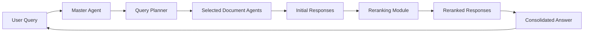

import { Callout, Steps, Step } from "nextra-theme-docs";

# Master Agent

The Master Agent is the central component of the Multi-Document Agent Q&A System, responsible for coordinating the query processing flow and managing the interactions between various sub-components. It acts as the main entry point for incoming queries and orchestrates the entire process of retrieving relevant information from the document agents.

## Role and Responsibilities

The primary responsibilities of the Master Agent include:

- Receiving incoming queries from users or external systems
- Invoking the [Query Planner](/query-processing/query-planner) to determine the most relevant document agents for each query
- Collecting responses from the selected document agents
- Applying the [Reranking Module](/query-processing/reranking-module) to refine the relevance scores based on additional contextual information
- Compiling the best responses to present a consolidated answer to the user

<Callout emoji="💡">
The Master Agent ensures that the query processing flow is efficient, accurate, and optimized for the best possible results.
</Callout>

## Query Processing Flow

The Master Agent follows a well-defined query processing flow to handle incoming queries effectively. The flow can be summarized in the following steps:

<Steps>

### Step 1: Query Planning
The Master Agent receives an incoming query and passes it to the Query Planner. The Query Planner analyzes the query's content and optional historical performance data to select the most appropriate document agents for handling the query.

### Step 2: Initial Response Gathering
The Master Agent engages the selected document agents and collects their initial responses. Each document agent evaluates the query against its encapsulated document partition and provides a relevance score.

### Step 3: Reranking
The Master Agent applies the Reranking Module to the initial responses. The Reranking Module refines the relevance scores by considering additional contextual information, improving the accuracy and precision of the retrieved information.

### Step 4: Response Compilation
The Master Agent compiles the best responses based on the reranked scores and generates a consolidated answer to the user's query.

</Steps>

The following diagram illustrates the query processing flow managed by the Master Agent:

## Example

Let's consider an example query: "What is the purpose of the VectorStoreIndex class in the llama_index library?"

The Master Agent would process this query as follows:

1. The Query Planner identifies the most relevant document agents based on the query's content and historical performance data.
2. The selected document agents evaluate the query against their respective document partitions and provide initial relevance scores.
3. The Reranking Module refines the relevance scores by considering additional contextual information.
4. The Master Agent compiles the best responses and generates a consolidated answer, such as:

   The VectorStoreIndex class in the llama_index library is used to embed and index text data for efficient vector-based retrieval. It provides methods for storing and querying vector representations of documents, enabling fast and accurate similarity searches. The VectorStoreIndex is a crucial component for building scalable and performant document retrieval systems.

By orchestrating the query processing flow and leveraging the capabilities of the Query Planner, document agents, and Reranking Module, the Master Agent ensures that users receive accurate and relevant answers to their queries.