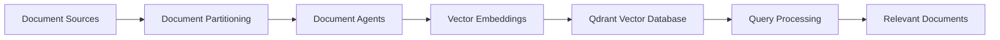

import { Callout, Steps, Step } from "nextra-theme-docs";

# System Architecture

The Multi-Document Agent Q&A System employs a distributed knowledge fabric that intelligently partitions textual document sources into separate semi-autonomous agents known as [Document Agents](/system-architecture/document-agents). These agents encapsulate the content and semantic essence of their designated document partitions through advanced [Vector Embeddings](/system-architecture/vector-embeddings), enabling efficient semantic searches and content retrieval.

At the core of this architecture lies the [Qdrant Vector Database](/system-architecture/qdrant-vector-database), which plays a crucial role in storing and retrieving document embeddings. This high-performance vector similarity search engine allows for rapid and accurate retrieval of relevant documents based on their semantic similarity to the input query.

<Callout type="info">
The distributed nature of the system architecture ensures scalability and flexibility, allowing it to handle large volumes of documents and complex queries efficiently.
</Callout>

The main components of the system architecture can be visualized using the following diagram:

The flow of data in the system architecture can be summarized in the following steps:

<Steps>

### Step 1

Document sources are partitioned into separate document agents, each responsible for a specific subset of the overall knowledge base.

### Step 2

Each document agent generates vector embeddings for its assigned documents, capturing their semantic content in a dense, numerical representation.

### Step 3

The vector embeddings are stored in the Qdrant Vector Database, allowing for efficient retrieval based on semantic similarity.

### Step 4

During query processing, the relevant document agents are selected based on the query's content and historical performance data.

### Step 5

The selected document agents retrieve the most relevant documents from the Qdrant Vector Database based on the semantic similarity between the query and the document embeddings.

</Steps>

By leveraging this distributed architecture and advanced vector embedding techniques, the Multi-Document Agent Q&A System achieves high performance, scalability, and accuracy in processing complex queries and retrieving relevant information from large document collections.