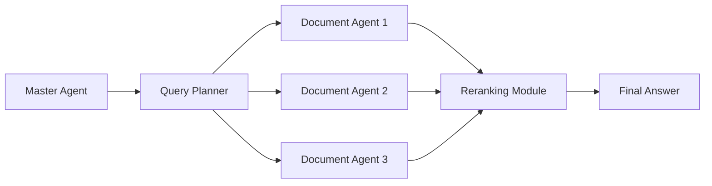

import { Callout, Steps, Step } from "nextra-theme-docs";

# Document Agents

Document Agents are a key component of the Multi-Document Agent Q&A System's distributed knowledge fabric. They encapsulate the content and semantic essence of document partitions, enabling efficient semantic searches and content retrieval.

## Encapsulating Document Partitions

Each Document Agent is responsible for a specific document partition. When documents are loaded into the system, they are partitioned into smaller, manageable chunks. These chunks are then assigned to individual Document Agents.

<Steps>

### Step 1: Document Partitioning

The input documents are partitioned into smaller chunks using the `partition` function from the `unstructured` library.

```python
elements = partition(filename=file_path)
```

### Step 2: Creating Document Agents

For each document partition, a Document Agent is created. The Document Agent is initialized with the document ID, content, and references to the Qdrant vector database.

```python
document_agents = {str(idx): DocumentAgent(document_id=idx,
                                           content=doc.text, 
                                           qdrant_client=qdrant_client,
                                           collection_name=COLLECTION_NAME)
                   for idx, doc in enumerate(documents)}
```

</Steps>

By encapsulating document partitions within Document Agents, the system achieves a distributed representation of knowledge, enabling parallel processing and efficient retrieval.

## Semantic Representation

Document Agents leverage advanced [vector embeddings](/system-architecture/vector-embeddings) to capture the semantic essence of their document partitions. These embeddings are generated using state-of-the-art language models and are stored in the [Qdrant vector database](/system-architecture/qdrant-vector-database).

<Callout type="info">
Vector embeddings enable the system to perform semantic searches, allowing it to retrieve relevant content based on the meaning and context of the query, rather than just keyword matching.
</Callout>

## Query Processing

During the query processing flow, the [Master Agent](/query-processing/master-agent) engages the Document Agents to retrieve relevant information. The [Query Planner](/query-processing/query-planner) strategically selects the most relevant Document Agents based on the query's content and historical performance data.

Each selected Document Agent then processes the query independently, leveraging its encapsulated knowledge to generate a response. The responses from multiple Document Agents are then combined and reranked by the [Reranking Module](/query-processing/reranking-module) to provide the most accurate and relevant answer to the user's query.



By leveraging the distributed knowledge representation and semantic capabilities of Document Agents, the Multi-Document Agent Q&A System achieves efficient and accurate question-answering over large corpuses of textual data.