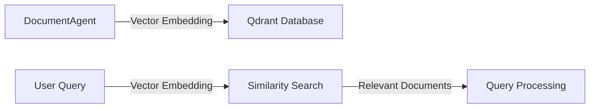

import { Callout, Steps, Step } from "nextra-theme-docs";

# Qdrant Vector Database

The Qdrant vector database plays a crucial role in the Multi-Document Agent Q&A System by efficiently storing and retrieving document embeddings. It enables the system to perform rapid similarity searches and find the most relevant documents based on the user's query.

## What is Qdrant?

Qdrant is a high-performance vector similarity search engine that allows you to store and search for vectors in a scalable manner. It is designed to handle large-scale datasets and provides fast and accurate similarity searches.

<Callout type="info">
Qdrant is an open-source project, and you can find more information about it on the [official Qdrant website](https://qdrant.tech/).
</Callout>

## How Qdrant is used in the system

In the Multi-Document Agent Q&A System, Qdrant is used to store the vector embeddings of the document partitions. Each [DocumentAgent](/system-architecture/document-agents) encapsulates a specific document partition and generates a vector representation of its content using advanced [vector embedding techniques](/system-architecture/vector-embeddings).

These vector embeddings are then stored in the Qdrant database, along with the corresponding document metadata. This allows the system to efficiently retrieve the most relevant documents based on the similarity between the query vector and the stored document vectors.

## Storing and retrieving document embeddings

The process of storing and retrieving document embeddings using Qdrant involves the following steps:

<Steps>
### Step 1: Generate vector embeddings

The DocumentAgents generate vector embeddings for their respective document partitions using advanced techniques such as Word2Vec, GloVe, or BERT. These embeddings capture the semantic meaning of the document content.

### Step 2: Store embeddings in Qdrant

The generated vector embeddings are stored in the Qdrant database along with the corresponding document metadata. This metadata can include information such as the document ID, source, and any other relevant attributes.

### Step 3: Perform similarity search

When a user query is received, the system generates a vector embedding of the query using the same embedding technique used for the documents. This query vector is then used to perform a similarity search in the Qdrant database.

### Step 4: Retrieve relevant documents

Qdrant efficiently searches for the most similar document vectors to the query vector using cosine similarity or other distance metrics. The top-k most similar documents are retrieved and passed on to the [query processing](/query-processing) components for further analysis and answer generation.
</Steps>

## Benefits of using Qdrant

Using Qdrant as the vector database in the Multi-Document Agent Q&A System offers several benefits:

- **Fast similarity searches**: Qdrant provides optimized algorithms and indexing techniques for quick and accurate similarity searches, even on large-scale datasets.

- **Scalability**: Qdrant is designed to handle massive amounts of data and can scale horizontally to accommodate growing datasets.

- **High-dimensional vector support**: Qdrant can efficiently store and search high-dimensional vectors, which is essential for representing complex document content.

- **Integration with machine learning frameworks**: Qdrant integrates seamlessly with popular machine learning frameworks, making it easy to incorporate into the overall system architecture.

By leveraging the capabilities of Qdrant, the Multi-Document Agent Q&A System can efficiently store and retrieve document embeddings, enabling fast and accurate similarity searches for improved query processing and answer generation.